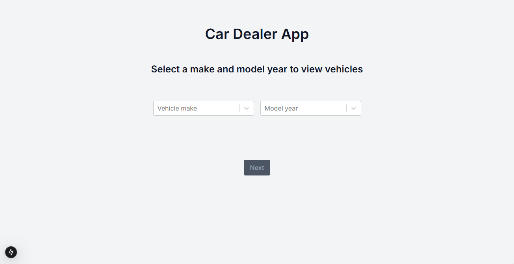
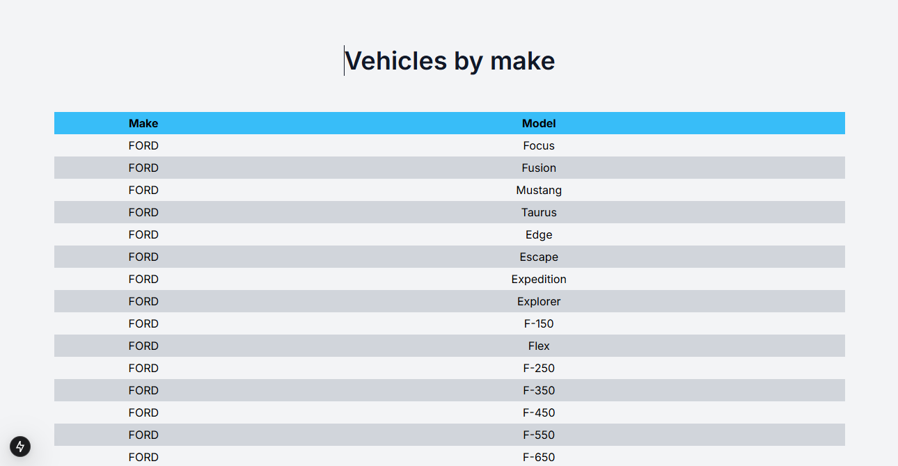

# Car Dealer App

## Description
This application was made for the users that want to know the cars raised by each make since 2015.
All you have to do is select the make and the year you want and the app will show you the cars raised by that company at that year.

## Prerequisits
- [Node.js](https://nodejs.org/) (version 18 or higher)
- [npm](https://www.npmjs.com/) (usually comes with Node.js)

## Instalation
1. Clone the repository:
  'git clone https://github.com/username/repository-name.git'

2. Go to the project folder
  'cd repository-name'

3. Install the dependencies:
  'npm install'

## Build and start
1. To build, run:
 'npm run build'

2. To start in dev mode, run:
  'npm run dev'

3. Access the application in your browser at 'http://localhost:3000'

## Screenshots
1. Initial page
  

2. Vehicles page
  
